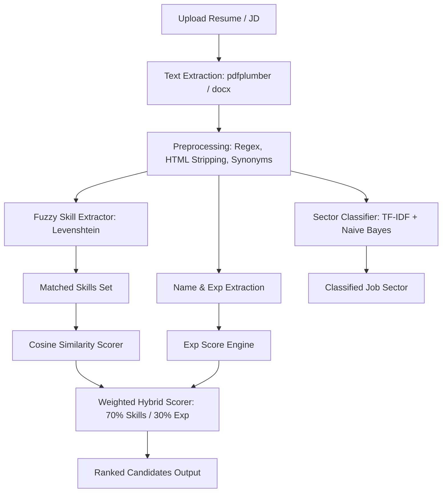

# TalentVector Backend Documentation

Welcome to the **TalentVector** (HR-Helper) backend documentation. This document explains the backend architecture, database schemas, and provides a rigorous, deep-dive explanation of the mathematical models, algorithms, and Machine Learning techniques used for resume parsing, classification, and ranking.

---

## 🚀 1. Technology Stack

*   **API Framework**: **FastAPI** (asynchronous Python, auto-generated OpenAPI documentation, fast execution).
*   **Production Server**: **Uvicorn** (lightning-fast ASGI web server implementation).
*   **Database Client**: **Motor** (asynchronous driver for MongoDB).
*   **Authentication & Hashing**: **PyJWT** (JSON Web Tokens) & **Passlib / Bcrypt** (PBKDF2-SHA256 password hashing).
*   **Text Parsers**: **pdfplumber** (precision layout parsing for PDFs) & **python-docx** (Word document text extraction).
*   **NLP & ML Core**: **Scikit-Learn** (TF-IDF vectorizer & Naive Bayes model), **SpaCy** (NLP pipeline capabilities), and **NLTK** (natural language preprocessing components).
*   **Email Engine**: **Resend API** & **SMTP (aiosmtplib)** (for asynchronous OTP mailing).

---

## 📁 2. Directory Structure & Architecture

The backend code resides in the `app/` directory:

```
app/
├── models/
│   ├── classifier.py          # Naive Bayes loader and inference code
│   ├── label_encoder.pkl      # Pickled Scikit-Learn LabelEncoder mapping indexes to text categories
│   ├── naive_bayes_model.pkl  # Trained Multinomial Naive Bayes classifier
│   ├── tag_mapping.json       # Grouping map for model classes
│   └── vectorizer.pkl         # Pickled TF-IDF Vectorizer
├── auth.py                    # Users collections, JWT issuance, Google OAuth & OTP routes
├── candidate.py               # Candidate CV upload, extraction, and job listing matching
├── constants.py               # Skill lists, name blocklists, synonyms, and domain mapping
├── database.py                # Async MongoDB motor client setup
├── extractor.py               # Levenshtein distance, skill lookup, name & experience parsing
├── mailer.py                  # HTML mail templates, Resend / SMTP client routing
├── main.py                    # Root FastAPI app, CORS middleware, scoring logic, and screen endpoints
├── ranker.py                  # Custom Vector Space model (Cosine Similarity) ranking algorithm
├── recruiter.py               # Recruiter jobs posting, screening history lists, and invitations
├── seed.py                    # Seeds mock candidate database records on startup if collection is empty
└── skills.json                # Pre-defined database of skills divided by technology categories
```

---

## ⚙️ 3. Database Schemas (MongoDB Async Collection)

The application stores data in three principal collections:
1.  **`users`**: Auth credentials, hashed passwords, roles (`candidate` or `recruiter`), avatar links, and status.
2.  **`candidate_profiles`**: Personal details (name, email, phone, bio), extracted skills, years of experience, detected career domain, and path to the stored PDF/Word CV.
3.  **`screenings`**: Audit logs of recruiter screening sessions, mapping the raw Job Description text, detected job domain, required experience, list of candidates evaluated, and their final match percentages.

---

## 🧠 4. Core Algorithms & Machine Learning Techniques

TalentVector employs a multi-tiered pipeline combining deterministic parsing, fuzzy matching, and probabilistic machine learning models.



### A. Text Extraction & Preprocessing
*   **pdfplumber**: Extract text page-by-page. It handles multi-column layouts by grouping character positions, preventing text overlapping.
*   **Text Cleaning (`clean_text`)**:
    *   Strips HTML tags using: `re.sub(r'<.*?>', '', text)`.
    *   Removes web URLs and hyper-links.
    *   Standardizes acronyms using a **Synonym Mapping Dictionary** (e.g. converting `js` $\rightarrow$ `javascript`, `aws` $\rightarrow$ `amazon web services`, `ml` $\rightarrow$ `machine learning`). This process aligns abbreviations to improve vector overlap.

---

### B. NLP Skill Parsing & Levenshtein Distance
Rather than relying on simple substring checks (which cause false positives, like matching "Go" inside "Google"), the extractor implements **Fuzzy Token Matching via Levenshtein Distance** with structural constraints.

#### 1. Levenshtein Distance Definition
The Levenshtein distance between two words $s_1$ (length $m$) and $s_2$ (length $n$) is the minimum number of single-character edits (insertions, deletions, or substitutions) required to change one word into the other.

It is computed recursively or via dynamic programming:

$$\text{lev}(s_1, s_2) = \begin{cases} 
      \max(i, j) & \text{if } \min(i, j) = 0, \\
      \min \begin{cases} 
          \text{lev}(i-1, j) + 1 \\ 
          \text{lev}(i, j-1) + 1 \\ 
          \text{lev}(i-1, j-1) + [s_1[i] \neq s_2[j]] 
      \end{cases} & \text{otherwise.}
   \end{cases}$$

#### 2. Fuzzy Matching Logic (`manual_extract_categorized_skills`)
1.  **Exact Token Match**: Compares words bounded by boundaries (`\b`) to spot exact matches.
2.  **Length Constraints**: Skips words shorter than 3 characters to prevent false matches (e.g., matching "C" inside "Cat").
3.  **Suffix Normalization**: Normalizes endings like "JS" (e.g., matching "reactjs" to "react").
4.  **Edit Distance Threshold**: Allows a distance of $\le 1$ for words under 8 characters, and $\le 2$ for longer words.
5.  **First-Letter Alignment**: Constrains matching tokens to share the same starting letter, reducing false matches (e.g., "Python" and "Typhon").

---

### C. Resume Sector Classification (TF-IDF + Naive Bayes)
When a resume is parsed, it is classified into one of 25 professional categories (e.g., "Data Science", "DevOps Engineer", "Sales"), which then map to 8 frontend sectors (Technology, Healthcare, Finance, Education, Sales, Management, Legal, General). This uses a pre-trained **Multinomial Naive Bayes Model**.

#### 1. Feature Extraction: TF-IDF Vectorization
Resumes are converted from raw text to numeric vector representations using **TF-IDF (Term Frequency-Inverse Document Frequency)**:

*   **Term Frequency ($TF$)**: Measures how frequently a term $t$ appears in document $d$:
    $$TF(t, d) = \frac{\text{Count}(t \text{ in } d)}{\text{Total terms in } d}$$
*   **Inverse Document Frequency ($IDF$)**: Measures how unique a term is across the entire corpus of $N$ documents:
    $$IDF(t) = \log\left(\frac{1 + N}{1 + DF(t)}\right) + 1$$
*   **TF-IDF Weight**: Combining both measures highlights terms that are frequent in a document but rare across other documents:
    $$w_{t,d} = TF(t, d) \times IDF(t)$$

#### 2. Probabilistic Classification: Multinomial Naive Bayes
The classifier assigns a resume vector $\mathbf{x} = (x_1, x_2, \dots, x_M)$ to the category $C_k$ that maximizes the posterior probability:

$$P(C_k \mid \mathbf{x}) \propto P(C_k) \prod_{i=1}^M P(x_i \mid C_k)^{x_i}$$

Where:
*   $P(C_k)$ is the prior probability of class $C_k$ (estimated from the training distribution).
*   $P(x_i \mid C_k)$ is the conditional probability of feature term $i$ given class $C_k$.
*   **Laplace Smoothing ($\alpha=1$)** is applied to avoid zero probabilities for terms not seen in training:
    $$P(x_i \mid C_k) = \frac{\text{Count}(x_i \text{ in } C_k) + \alpha}{\sum (\text{Count of terms in } C_k) + \alpha \cdot M}$$

---

### D. Skill Similarity Scoring (Cosine Similarity)
Rather than matching entire text blocks which contain noise, the **ranking engine focuses only on extracted skills**.

#### Cosine Similarity Definition
The similarity between a Job Description skill vector $\mathbf{A}$ and a Resume skill vector $\mathbf{B}$ is calculated as the cosine of the angle between them in a vector space where each unique skill is a dimension:

$$\text{Similarity}(\mathbf{A}, \mathbf{B}) = \cos(\theta) = \frac{\mathbf{A} \cdot \mathbf{B}}{\|\mathbf{A}\| \|\mathbf{B}\|} = \frac{\sum_{i=1}^n A_i B_i}{\sqrt{\sum_{i=1}^n A_i^2} \sqrt{\sum_{i=1}^n B_i^2}}$$

*   Since we use binary occurrence frequencies for individual skill lists, this yields a score between $0.0$ (no matching skills) and $1.0$ (identical skill profiles).

---

### E. Experience Match Score Engine
The system uses different scoring logic based on how the experience requirement is written in the Job Description.

#### CASE A: Threshold Matching ("Required+")
If the JD specifies "3+ years", it represents a threshold. The candidate gets full marks if their experience meets or exceeds this target:

$$\text{ExpScore}(E_{cand}, E_{req}) = \begin{cases} 
      100\% & \text{if } E_{cand} \ge E_{req} \\
      \left(\frac{E_{cand}}{E_{req}}\right) \times 100 & \text{if } E_{cand} < E_{req}
   \end{cases}$$

#### CASE B: Precision Matching (Distance Penalty)
If the JD specifies an exact requirement (e.g. "3 years"), the system applies a distance-based penalty for both under-experience and over-experience (to avoid overqualification issues):

$$\text{ExpScore}(E_{cand}, E_{req}) = \begin{cases}
      100\% & \text{if } |E_{cand} - E_{req}| = 0 \\
      70\% & \text{if } |E_{cand} - E_{req}| = 1 \\
      40\% & \text{if } |E_{cand} - E_{req}| = 2 \\
      10\% & \text{otherwise}
   \end{cases}$$

---

### F. Hybrid Scoring Combinator
The final match percentage is computed as a weighted combination of the skill overlap and experience scores:

$$\text{Final Score} = \left(\text{Skill Cosine Similarity} \times 0.70\right) + \left(\text{Experience Score} \times 0.30\right)$$

This weighting ensures that having the right skills remains the primary criteria, while relevant work duration acts as a secondary filter.

---

## 🛠️ 5. How to Run & Validate Locally

1.  **Configure Environment Variables**:
    Create `app/.env` (and copy to the root folder for direct CLI scripts):
    ```env
    PORT=8000
    FRONTEND_URL=http://localhost:5173
    JWT_SECRET_KEY=your_secure_jwt_secret_key
    MONGO_URI=your_mongodb_connection_string
    SMTP_SERVER=smtp.gmail.com
    SMTP_PORT=465
    SENDER_EMAIL=talentvector00@gmail.com
    SENDER_PASSWORD=your_sender_app_password
    RESEND_API_KEY=your_resend_api_key
    ```

2.  **Start Dev Database & Backend Server**:
    From the root directory:
    ```bash
    npm run backend
    ```
    This launches the FastAPI server using Uvicorn on port 8000. It will automatically check the database connection, seed initial mock candidates, and serve the API.
